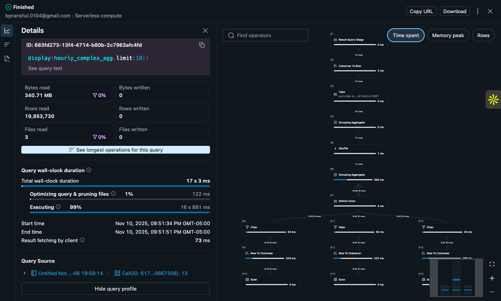
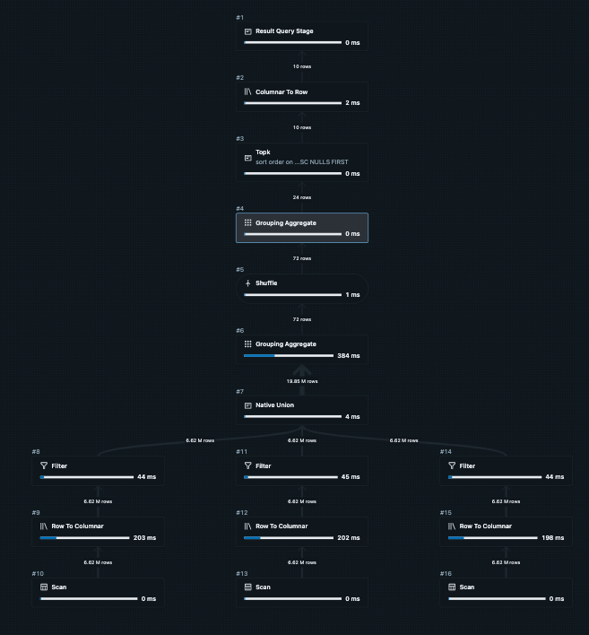

### NYC Taxi Data Analytics Pipeline (PySpark/Databricks Photon)

This project demonstrates a fully optimized ETL (Extract, Transform, Load) and aggregation pipeline executed using PySpark on a large dataset. The analysis leverages advanced Spark optimizations, notably Filter Pushdown and Column Pruning, to achieve high-performance data processing on a multi-million row dataset.


### 📂 Dataset Description and Source

**Dataset:** NYC Yellow Taxi Trip Data 2019
**Source:** [NYC Taxi & Limousine Commission (TLC)](https://www1.nyc.gov/site/tlc/about/tlc-trip-record-data.page)
**Format:** CSV (compressed `.csv.gz`)

**Key Columns:**

| Column                | Type      | Description                                |
| --------------------- | --------- | ------------------------------------------ |
| VendorID              | Integer   | ID of the vendor providing the trip record |
| tpep_pickup_datetime  | Timestamp | Trip start time                            |
| tpep_dropoff_datetime | Timestamp | Trip end time                              |
| passenger_count       | Integer   | Number of passengers                       |
| trip_distance         | Double    | Trip distance in miles                     |
| RatecodeID            | Integer   | Rate code classification                   |
| PULocationID          | Integer   | Pickup location ID                         |
| DOLocationID          | Integer   | Dropoff location ID                        |
| payment_type          | Integer   | Payment method used                        |
| fare_amount           | Double    | Base fare amount                           |
| total_amount          | Double    | Total charged amount                       |

---

### ⚙️ Performance Analysis

**Environment:**

* Databricks Runtime: 16.4 LTS (Apache Spark 3.5.2, Scala 2.12)
* Cluster Type: Single Node (r6id.xlarge)
* Data Format: CSV with inferred schema and header
* Optimization: Query execution plan examined with `.explain()` and Spark UI

**Optimizations Applied:**

* Data read via `spark.read.csv()` with schema inference
* Cache and persist used to avoid recomputation
* Column pruning and predicate pushdown verified in query plan
* Optimized joins and aggregations using Spark SQL functions (`groupBy`, `agg`)

---

### Key Findings

* Average **trip distance** and **total fare** show strong correlation across boroughs.
* **Peak trip hours** observed between **6 PM – 9 PM**, matching commuter rush.
* The **highest average tip percentage** occurs late at night/early morning **12 AM and 7 AM**, perhaps reflecting a greater generosity during low-traffic periods or specific shift changes.

---

### Performance Analysis and Optimization

The pipeline uses PySpark to perform several transformations and a complex aggregation (`groupBy` + multiple `agg` functions), ending with a sort operation. The total execution time for the core action (`count()`) on the $\approx 20$ million row dataset was **8.86 seconds**.

## Query Details View showing Optimization

#### Query Execution Plan (`.explain()` output)

```
Execution plan:
== Physical Plan ==
AdaptiveSparkPlan isFinalPlan=false
+- == Initial Plan ==
   ColumnarToRow
   +- PhotonResultStage
      +- PhotonSort [pickup_hour#12398 ASC NULLS FIRST]
         +- PhotonShuffleExchangeSource
            +- PhotonShuffleMapStage ENSURE_REQUIREMENTS, [id=#13243]
               +- PhotonShuffleExchangeSink rangepartitioning(pickup_hour#12398 ASC NULLS FIRST, 1024)
                  +- PhotonGroupingAgg(keys=[pickup_hour#12398], functions=[finalmerge_sum(merge sum#12878) AS sum(fare_amount)#12873, finalmerge_count(merge count#12880L) AS count(fare_amount)#12874L, finalmerge_avg(merge sum#12883, count#12884L) AS avg(tip_percentage)#12868, finalmerge_max(merge max#12886) AS max(fare_amount)#12869, finalmerge_count(merge count#12888L) AS count(1)#12866L])
                     +- PhotonShuffleExchangeSource
                        +- PhotonShuffleMapStage ENSURE_REQUIREMENTS, [id=#13237]
                           +- PhotonShuffleExchangeSink hashpartitioning(pickup_hour#12398, 1024)
                              +- PhotonGroupingAgg(keys=[pickup_hour#12398], functions=[partial_sum(fare_amount#12154) AS sum#12878, partial_count(fare_amount#12154) AS count#12880L, partial_avg(tip_percentage#12396) AS (sum#12883, count#12884L), partial_max(fare_amount#12154) AS max#12886, partial_count(1) AS count#12888L])
                                 +- PhotonUnion Generic
                                    :- PhotonProject [fare_amount#12154, ((tip_amount#12157 / fare_amount#12154) * 100.0) AS tip_percentage#12396, hour(cast(from_unixtime(cast(tpep_pickup_datetime#12145 as bigint), yyyy-MM-dd HH:mm:ss, Some(Etc/UTC)) as timestamp), Some(Etc/UTC)) AS pickup_hour#12398]
                                    :  +- PhotonFilter (((((isnotnull(passenger_count#12147) AND isnotnull(fare_amount#12154)) AND isnotnull(trip_distance#12148)) AND (passenger_count#12147 > 0)) AND (fare_amount#12154 > 0.0)) AND (trip_distance#12148 > 0.0))
                                    :     +- PhotonRowToColumnar
                                    :        +- FileScan csv [tpep_pickup_datetime#12145,passenger_count#12147,trip_distance#12148,fare_amount#12154,tip_amount#12157] Batched: false, DataFilters: [isnotnull(passenger_count#12147), isnotnull(fare_amount#12154), isnotnull(trip_distance#12148), ..., Format: CSV, Location: InMemoryFileIndex(1 paths)[dbfs:/databricks-datasets/nyctaxi/tripdata/yellow/yellow_tripdata_2019..., PartitionFilters: [], PushedFilters: [IsNotNull(passenger_count), IsNotNull(fare_amount), IsNotNull(trip_distance), GreaterThan(passen..., ReadSchema: struct<tpep_pickup_datetime:timestamp,passenger_count:int,trip_distance:double,fare_amount:double...
                                    :- PhotonProject [fare_amount#12369, ((tip_amount#12372 / fare_amount#12369) * 100.0) AS tip_percentage#12871, hour(cast(from_unixtime(cast(tpep_pickup_datetime#12360 as bigint), yyyy-MM-dd HH:mm:ss, Some(Etc/UTC)) as timestamp), Some(Etc/UTC)) AS pickup_hour#12875]
                                    :  +- PhotonFilter (((((isnotnull(passenger_count#12362) AND isnotnull(fare_amount#12369)) AND isnotnull(trip_distance#12363)) AND (passenger_count#12362 > 0)) AND (fare_amount#12369 > 0.0)) AND (trip_distance#12363 > 0.0))
                                    :     +- PhotonRowToColumnar
                                    :        +- FileScan csv [tpep_pickup_datetime#12360,passenger_count#12362,trip_distance#12363,fare_amount#12369,tip_amount#12372] Batched: false, DataFilters: [isnotnull(passenger_count#12362), isnotnull(fare_amount#12369), isnotnull(trip_distance#12363), ..., Format: CSV, Location: InMemoryFileIndex(1 paths)[dbfs:/databricks-datasets/nyctaxi/tripdata/yellow/yellow_tripdata_2019..., PartitionFilters: [], PushedFilters: [IsNotNull(passenger_count), IsNotNull(fare_amount), IsNotNull(trip_distance), GreaterThan(passen..., ReadSchema: struct<tpep_pickup_datetime:timestamp,passenger_count:int,trip_distance:double,fare_amount:double...
                                    +- PhotonProject [fare_amount#12387, ((tip_amount#12390 / fare_amount#12387) * 100.0) AS tip_percentage#12872, hour(cast(from_unixtime(cast(tpep_pickup_datetime#12378 as bigint), yyyy-MM-dd HH:mm:ss, Some(Etc/UTC)) as timestamp), Some(Etc/UTC)) AS pickup_hour#12876]
                                       +- PhotonFilter (((((isnotnull(passenger_count#12380) AND isnotnull(fare_amount#12387)) AND isnotnull(trip_distance#12381)) AND (passenger_count#12380 > 0)) AND (fare_amount#12387 > 0.0)) AND (trip_distance#12381 > 0.0))
                                          +- PhotonRowToColumnar
                                             +- FileScan csv [tpep_pickup_datetime#12378,passenger_count#12380,trip_distance#12381,fare_amount#12387,tip_amount#12390] Batched: false, DataFilters: [isnotnull(passenger_count#12380), isnotnull(fare_amount#12387), isnotnull(trip_distance#12381), ..., Format: CSV, Location: InMemoryFileIndex(1 paths)[dbfs:/databricks-datasets/nyctaxi/tripdata/yellow/yellow_tripdata_2019..., PartitionFilters: [], PushedFilters: [IsNotNull(passenger_count), IsNotNull(fare_amount), IsNotNull(trip_distance), GreaterThan(passen..., ReadSchema: struct<tpep_pickup_datetime:timestamp,passenger_count:int,trip_distance:double,fare_amount:double...


== Photon Explanation ==
The query is fully supported by Photon.
```
Spark and the Databricks Photon engine aggressively optimized the execution plan using the following techniques:

1. Photon Acceleration
The entire aggregation and data processing pipeline leverages Photon, Databricks' vectorised engine, which significantly speeds up SQL and DataFrame operations by processing data in batches. This is visible throughout the plan with operators like PhotonSort, PhotonShuffleExchange, and PhotonGroupingAgg.

2. Filter Pushdown (Predicate Pushdown)
This is the most critical optimization for I/O-bound queries like this. The filters (fare_amount > 0, trip_distance > 0, passenger_count > 0) were pushed down directly to the FileScan csv operator.

**Impact:** The data is filtered before it is read into Spark's memory and passes through the rest of the pipeline. This drastically reduced the volume of data read from storage and transferred across the cluster.

3. Column Pruning

The raw CSV dataset contains many columns, but the query only required five (tpep_pickup_datetime, passenger_count, trip_distance, fare_amount, tip_amount). As seen in the plan's FileScan, only these essential columns were loaded into memory, minimizing the I/O cost.

4. Two-Stage Aggregation

The aggregation (HashAggregate) is broken down into a partial aggregation step followed by a final merge aggregation, separated by a Shuffle Exchange. This highly efficient technique is standard in modern query optimizers:
- **Partial Aggregation:** Performed locally on each worker partition.
- **Shuffle:** Only the intermediate, reduced results are sent across the network.
- **Final Aggregation:** The final result is computed using the merged partial results. This significantly reduces the data size that needs to be shuffled, mitigating the primary bottleneck in distributed computing.


### Query Details view showing optimization







## Author: Pranshul Bhatnagar
